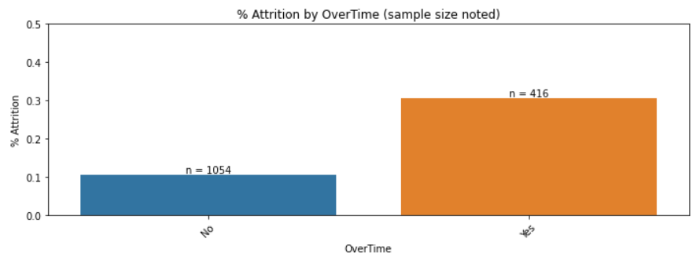

# Predicting Employee Attrition

### The problem

*By now everyone has seen a headline about the 'Great Resignation' - the significantly high employee attrition rates following the COVID-19 pandemic.  While the name may imply that the phenomenon is new and temporary, it is actually a continuation of a decade-long trend of increasing voluntary attrition (https://hbr.org/2022/03/the-great-resignation-didnt-start-with-the-pandemic).  Thus, HR teams will need to continue to contend with rising turnover among the myriad of other issues they are facing such as the rise of remote/hybrid work arrangements and the corresponding heightened fluidity in the talent market.*

### The cost

*Voluntary turnover has various tangible costs. More direct costs include money spent on recruiters and position advertisements, internal time spent recruiting and interviewing, and onboarding/training costs/time. Less direct costs can include lost revenue (e.g., lost clients for customer-facing roles) and higher costs driven by lower efficiency due to less experience with the company. For salaried employees, some experts estimate that turnover can cost tens of thousands of dollars, even up to two times salary (https://www.gallup.com/workplace/236051/real-value-getting-exit-interview-right.aspx).*

### The response

*Companies are building and expanding their People Analytics teams to apply data science and advanced analytics to help meet these challenges.  In this project, I have used a public HR dataset containing anonymized information about ~1,500 employees at a company to develop a statistical model to predict employee attrition (https://data.world/aaizemberg/hr-employee-attrition).  The information includes fields such as role, department, educational background, compensation, demographic information, internal and external work history, responses to employee surveys (about, for example, engagement, work-life balance, etc.) and, of course, whether that employee voluntarily left.*

*This is a real-world dataset and, to my knowledge, not part of any competitions – my model is original and was not developed with reference to any other work performed on this dataset.*

## The Data

The table below shows the fields available in the dataset, separated by category. The target feature is a binary label called Attrition.

(Certain other fields were also present but are omitted because they did not provide meaningful information)

The data was already clean and did not have missing values.

## Visualizing the Information

Many of the fields exhibited at least a slight correlation with attrition rate.  Below, we focus on some of the more prominent associations.  Note that these do not necessary suggest causation, and many features are likely related (e.g., job role and whether it is overtime-eligible).

**Numerical variables:**

*Age*: Attrition is higher among younger people.  Note the maximum age in this dataset is 60 - this may have been done intentionally to minimize the presence of retirements in the data set.

*Distance from home*: Attrition is higher among those who live farther from work.

*Number of prior companies*: While not obvious from the graphic below, attrition rate is positively correlated with number of prior companies worked at, likely due at least in part to confounding factors (e.g., employee may be in a function or role that is prone to high turnover in general).

Note on the graph: the median number of companies worked for the Attrition group is 1, which is less than the median for the non-Attrition group. However, the tail is longer for the Attrition group, and the average is higher.

*Total working years*: Similar to the trend for age, attrition is higher among those with fewer total working years.

*Years with current manager*: The longer someone has the same manager, the less likely they are to leave.

**Categorical variables:**

*Survey responses*: Various survey responses related to employee satisfaction were correlated with attrition rates.

*Overtime-eligible*: Overtime-eligible positions experience higher turnover.

*Travel frequency*: Higher amounts of travel are associated with higher turnover.

*Marital status*: Single, never-married employees exhibit higher attrition levels.

*Job role*: Certain roles experience higher attrition rates.

## Feature Engineering

*Ordinal categorical variables*: Certain fields were treated as ordinal categorical variables, such as some of the survey response fields (where the responses range from 1 to 4).  However, certain survey questions showed little difference in attrition rate among values from 2-4, but had a much higher attrition probability for a response of 1; these were binary encoded as 0 for a response of 1, or 1 for a response of greater than 1.

*Nominal categorical variables*: Nominal categorical variables were encoded using dummy encoding. I reviewed which value was "lost" from each feature in the process to confirm that it was not a value that was strongly associated with higher likelihood of attrition based on EDA, so our interpretation of the model would remain intuitive. For example, the value "lost" from the BusinessTravel feature was "Non-Travel," which is the value least positively associated with attrition.

*Numeric variables*: Numerical fields such as age, monthly income, total working years, etc. were scaled using a power transformer due to their long-tailed distributions.

See the relevant notebooks for greater detail.

## Modeling & Predicting

This exercise was a binary classification problem, so I primarily explored a logistic regression and a random forest classifier.  I also used Pycaret to quickly check other models.

The logistic regression had the best results, consisting of high precision but low recall.  The confusion matrix for the test set is shown below.

As shown by the table below, I confirmed that changing the probability threshold for classification did not increase recall without a similar or greater drop in precision.

As shown by the PyCaret results below, none of the other models yielded high precision and high recall either.

I believe this is a product of attrition being potentially driven by many factors, including factors beyond the information available in the database (e.g., being recruited for a better opportunity; life events such as relocation, career shifts, going back to school; etc.).

Nevertheless, the high precision suggests the model can be a valuable supplement to manager intuition; i.e., if the model predicts a flight risk, it is usually real, and we have the opportunity to take action if desired.

As previewed in the visualization section earlier, the chart below shows which characteristics have the largest predictive impact in the model, as measured by SHAP feature importance.

## Opportunities for Improvement

The main opportunity for improvement in the model is to improve recall, which could be achieved with more/better features.  In other words, there are other factors at play that the dataset does not have. The more we are able to capture, the higher the recall we should be able to achieve.  Besides the examples mentioned above — being recruited and life events, which we may not be able to track — there are other features that we may actually be able to track, e.g., asking via survey whether an employee feels a sense of mission/purpose with their role and/or the company (which is correlated with retention according to https://www.netsuite.com/portal/resource/articles/human-resources/employee-turnover-causes.shtml).

However, because there is so much we can't know, it is doubtful recall will ever be very high.  So, the model would likely remain merely a supplement to managerial intuition/context, and in this vein one other opportunity for improvement would be the development of a clear reporting interface that clearly shows the predicted flight risks and the drivers underlying those predictions.

Aside from feature expansion, in terms of modeling specifically, one other approach that could yield improved results is ensemble modeling, i.e. using a consensus of multiple models to make predictions.
